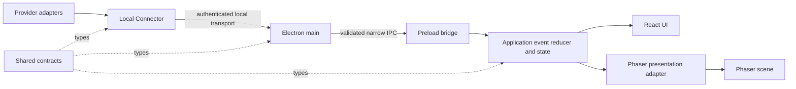

# Application architecture

Coffee Break is a local-first desktop application. Electron is the trusted desktop host, React renders application UI, and Phaser renders the virtual office. An independent Node.js Connector will translate provider activity into the provider-neutral contracts in `packages/contracts`.

The Electron shell, React office interface, fixed Phaser scene with simulated agents, and shared contract package exist today. US-013 adds an Electron-main local ingress capability; ordinary desktop startup does not activate it. US-014 adds the narrow preload bridge and one renderer application state store. The Connector process and runtime presentation mapping remain planned work.

## Responsibilities

| Module | Status | Responsibility |
| --- | --- | --- |
| Electron main | Implemented shell and inactive ingress capability | Own the application lifecycle and windows. The ingress authenticates a local Connector, validates and deduplicates events, and maintains a minimal synchronization mirror. US-015 will activate it with an owned simulator child. |
| Electron preload | Agent-state bridge implemented | Expose one typed `window.coffeeBreak.agentState.watch` capability through `contextBridge`. It does not expose Electron IPC primitives, filesystem, shell, or general Node.js access. |
| React UI | Office shell and read-only simulated-agent inspection implemented; live state views planned | Render desktop chrome and accessible controls from application state. It never calls provider APIs or the Connector. |
| Phaser scene | Fixed EP-02 office and simulated-agent presentation implemented | Render office entities and animations from a presentation model. It does not own integration state and does not call React, providers, or the Connector. |
| Application events and state | Renderer store and pure reducer implemented; presentation consumers planned | The renderer store owns synchronized agent lifecycle, activity, and connection data. React selectors and a Phaser adapter will read it in US-016. |
| Shared contracts | Initial contracts and mandatory activity implemented | Define provider-neutral identities, lifecycle states, and events used on process boundaries. Contracts contain no Electron, React, Phaser, or provider SDK types. |
| Local Connector | Planned for EP-04 | Observe supported local providers, normalize their payloads, and send validated-shape application events to Electron. It does not know about React, Phaser, UI copy, or animations. |

## Allowed dependency direction



Dependencies move toward provider-neutral events and state. React and Phaser may share selectors or presentation types, but neither imports or controls the other. Provider adapters remain inside the Connector. The Connector must not encode visual concepts such as a coffee-machine animation.

## Shared event contracts

Every application event has an `id`, `type`, ISO 8601 `timestamp`, `source`, and `payload`. `source` identifies the local Connector instance, not the upstream provider. `AgentIdentity` supplies a stable provider-neutral ID and display name. `AgentLifecycleState` is limited to `idle`, `working`, `waiting`, `completed`, and `error`.

US-004 defines one event: `agent.state.changed`. US-013 makes bounded, provider-neutral `activity` mandatory in the same payload as agent identity and lifecycle state; the optional reason still covers approval waits and exhausted capacity. Provider request IDs, raw messages, token counts, SDK objects, and credentials do not cross into renderer-facing contracts.

TypeScript types do not validate untrusted runtime data. Electron main validates the complete envelope and the payload selected by `type` before making a message available to future renderer delivery. Unknown event types, unknown fields, invalid timestamps, oversized messages, and malformed identities are rejected with fixed diagnostic codes that do not include secrets.

## State ownership, ordering, and deduplication

Electron main owns the accepted-event boundary and a minimal current-state mirror with a monotonic local revision. The renderer application store owns renderer session state. Neither React components nor Phaser objects mutate integration state directly. The pure reducer applies trusted current state and accepted changes; React and Phaser will receive derived views in US-016.

US-014 uses fixed main IPC handlers and a sandboxed preload watch capability. Main subscribes to ingress before reading its current state in the same turn. Preload attaches its listener before opening the watch, buffers notifications until the initial state is delivered, and then drains them in order. Revision orders agent data; same-revision phase notifications remain meaningful. A notification with a revision gap can repair the renderer from its complete trusted mirror. Invalid or incomplete mirrors retain the last valid agents and cause one fresh atomic watch/read attempt. Disconnect changes only connection status. Renderer bootstrap owns the watch outside React component effects and closes it on unload; main also closes it on window navigation or destruction. Ordinary startup composes but does not start ingress.

Event IDs are unique within a Connector instance. Electron main uses `(source.instanceId, event.id)` as the deduplication key in a bounded recent-event cache. Repeated IDs from the same Connector instance are duplicates within that cache window; identical IDs from different Connector instances are distinct events. Accepted events are applied in arrival order. The provider-supplied occurrence time is normalized to `timestamp` for display and diagnostics, not used to reorder state. If a provider later requires replay or deterministic reordering, sequence metadata and persistence must be designed explicitly rather than inferred from timestamps.

## Security and local communication

US-013 assigns the minimum local transport, authentication, runtime validation, synchronization, and reconnection-capable session protocol to EP-03. Electron main's inactive ingress capability binds a Node `net` listener only to `127.0.0.1` on an OS-assigned port. The exact wire protocol, secret handling, limits, and mirror behavior are documented in [local-transport.md](local-transport.md). US-015 will activate this capability with the owned development simulator; real provider adapters and production Connector orchestration remain EP-04 work.

Renderer security settings enforce `contextIsolation: true`, `sandbox: true`, and `nodeIntegration: false`. The bundled CommonJS preload exposes only the application-specific agent-state watch capability and removes its listener on close or failure. Main projects only accepted state, activity, phase, revision, and session data; token, endpoint, event envelope metadata, and diagnostics remain private. The renderer receives no unrestricted `send`, `invoke`, filesystem, shell, socket, or Node.js API.

## Example: Codex capacity exhaustion

1. A future Codex adapter observes a provider-specific token-exhaustion notification.
2. The Connector maps the provider identity to a stable `AgentIdentity` and emits a provider-neutral `agent.state.changed` event. It chooses `waiting` with reason `capacity_exhausted`; it does not choose UI text or an animation.
3. The authenticated local transport delivers the serialized event to Electron main, crossing the explicit untrusted-to-trusted boundary.
4. Main verifies the peer, message size, envelope, event payload, and recent event ID. It rejects invalid or duplicate input.
5. Preload forwards the accepted event through the narrow subscription API.
6. The application reducer updates the agent's lifecycle state. React can present an accessible status label, while the Phaser adapter derives a presentation cue for the scene. Phaser decides how to represent that cue; the Connector never knows about the representation.

Example normalized event:

```json
{
  "id": "evt_01",
  "type": "agent.state.changed",
  "timestamp": "2026-09-22T20:00:00.000Z",
  "source": {
    "kind": "local-connector",
    "instanceId": "connector_local_01"
  },
  "payload": {
    "agent": {
      "id": "mock-agent-ari",
      "displayName": "Ari"
    },
    "state": "waiting",
    "activity": "Waiting for capacity",
    "reason": "capacity_exhausted"
  }
}
```

## Decisions and deferred work

Decisions in US-004:

- Provider data is normalized before it reaches Electron or renderer code.
- Electron main is the runtime validation and trust boundary.
- Renderer application state is the single session-state owner consumed independently by React and Phaser.
- Shared contracts remain small and provider-neutral.
- Secure renderer settings remain mandatory.

Deferred work:

- The fixed Phaser office and simulated-agent animations were implemented in EP-02; live-state presentation adapters and behavior remain future work.
- EP-03 implements the minimum authenticated local transport, validation, synchronization, and reconnection-capable protocol. US-014 adds the preload bridge and renderer store; US-015 activates the ingress and simulator; US-016 maps state to presentation; US-017 completes user-visible loss and recovery behavior.
- Real-provider Connector adapters, production process orchestration, and any broader transport or backpressure policy remain EP-04 work and require their own review.
- Persistence, replay, telemetry, and broader recovery policies remain future work.
- Codex and GitHub integrations, release packaging, and Windows support are outside US-004.
