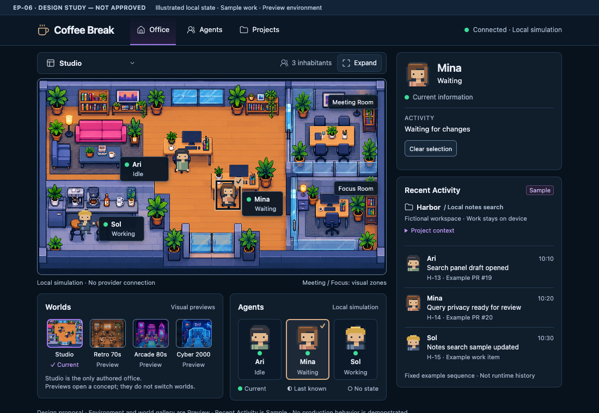
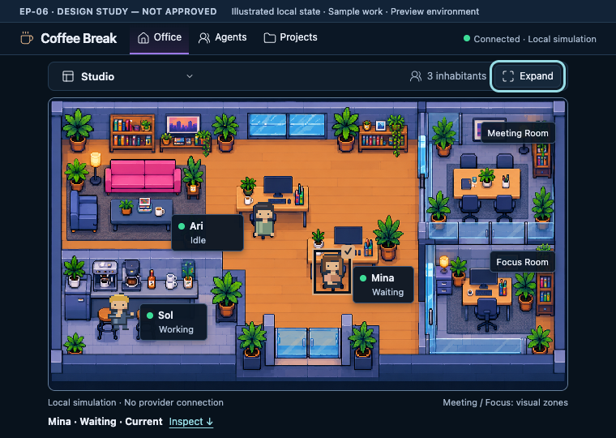

# Archived Designer fidelity specification/report

This is the final Designer fidelity revision from **Agent | Designer**, preserved in its original Spanish. Its proposal/pending-approval statements describe the original submission, before the Product Owner approval recorded in [the current manifest](README.md). They are historical, not the current design status. Original image banners are preserved for the same reason.

Source: Codex thread `01a0ee18-a070-7e11-8253-6f27ff9a134e`, turn `01a11887-ee93-7d63-a082-f78e465f4683`, final message `msg_022d86c7bdb2e1ae016ac6d26335fc87d199aa200c8148f84f`. The report body is preserved without substantive editing; its six local study-image links are localized and one two-space Markdown hard break is represented by a backslash to pass whitespace checks. Prototype validation is design-study evidence, not production verification.

---

# EP-06 — Revisión de fidelidad

**Nueva propuesta, pendiente de aprobación.** Recompuse la homepage con una paleta más cercana al North Star, toolbar propia, etiquetas oscuras, selector vertical de agentes, Worlds y Recent Activity lateral.

Baseline: `main`, HEAD `2edcc10fd45e2153f44d8ce8752879907b6a14cd`. El repositorio permanece limpio. Todos los estudios nuevos están fuera del repositorio; las referencias originales del Product Owner permanecen intactas.

## 1. Matriz de fidelidad: North Star frente al refinamiento anterior

La referencia principal para composición e inspección es el North Star 03; el 01 complementa el contraste entre oficina cálida y aplicación oscura.

| Aspecto | NORTH STAR | CURRENT REFINEMENT | DIFFERENCE | WHY DIFFERENT | KEEP DIFFERENCE? | CHANGE TOWARD NORTH STAR? |
|---|---|---|---|---|---|---|
| Composición | Oficina, lateral contextual y regiones inferiores diferenciadas | Oficina, inspector y tarjetas inferiores | Estructura más plana | Simplificación excesiva del esqueleto | No | Recuperar toolbar, Worlds y lateral de actividad |
| Paleta | Navy profundo y superficies azules | Teal oscuro y texto crema | Familia cromática distinta | Continuidad con EP-05 | Parcialmente | Acercar chrome y paneles al azul |
| Densidad | Entorno, retratos, previews y actividad | Grandes regiones con poco contenido | Menor riqueza visual | Priorización anterior de mínimos funcionales | No | Incorporar contenido Sample/Preview útil |
| Jerarquía | Varias capas reconocibles | Casi todo pertenece al mismo nivel | Menor sensación de aplicación completa | Falta de office chrome | No | Separar capas |
| Dimensiones | Oficina amplia y lateral sustancial | Oficina 640×360 y lateral 304px | Menor superficie total | Ventana objetivo y escala canónica | Sí | Mantener tamaños; mejorar distribución |
| Framing | Oficina contenida y asociada a controles | Borde alrededor de la escena | Falta contexto de mundo | Toolbar omitida | No | Añadir encabezado local |
| Toolbar | Mundo, contexto y expansión | Ausente | Región importante perdida | Se eliminó por falta de backend | No | Recuperarla con semántica local |
| Right rail | Inspección y actividad | Principalmente inspector | Actividad fuera de su región natural | Separación anterior de Sample | No | Recent Activity debajo del inspector |
| Inspector | Identidad prominente y detalle contextual | Panel alto con espacio sobrante | Menor densidad | Altura generosa del baseline | No | Compactar sin truncar información |
| Contenido inferior | Agents y Worlds | Agents, Harbor y actividad | Prioridades diferentes | Harbor ganó demasiado peso | No | Worlds y Agents recuperan la franja |
| Selector | Retrato, dot, nombre debajo, texto secundario | Retrato lateral y texto a la derecha | Organización distinta | Reutilización de tarjetas existentes | No | Selector vertical |
| Cantidad de agentes | Plantilla numerosa | Ari/Mina/Sol | Menor población | Identidades canónicas disponibles | Sí | No inventar habitantes |
| Etiquetas del mundo | Plaques oscuras flotantes | Etiquetas blancas separadas | Contraste y lenguaje diferentes | Herencia de la escena actual | No | Unificar identidad y lifecycle en plaque oscura |
| Dots | Motivo verde recurrente | Sage y frescura escrita junto al nombre | Menor presencia visual | Tratamiento conservador | Parcialmente | Verde más claro, con significado de frescura |
| Selección | Acento violeta | Coffee cálido y check | Acento diferente | Convención aceptada de Coffee Break | Sí | Violeta para navegación; coffee para selección |
| Entorno | Cristal, zonas, mobiliario y props agrupados | Sala más abierta y sencilla | Falta zonificación | Alcance visual anterior más pequeño | No | Meeting/Focus decorativos y mayor articulación |
| Workstations | Relaciones personaje–mesa–monitor claras | Relaciones existentes y cues confiables | Arte de entorno menos rico | Compatibilidad del baseline | Sí, semántica | Evolucionar arte preservando cues |
| Espaciado | Agrupaciones compactas | Separaciones amplias y paneles vacíos | Menor ritmo visual | Layout conservador | Parcialmente | Reducir padding y alturas sobrantes |
| Bordes | Azules discretos | Límites más visibles y gris teal | Mayor peso del contorno | Convenciones anteriores | Parcialmente | Separar borde decorativo y borde interactivo |
| Radios | Paneles redondeados; controles menores | Radios similares en muchas regiones | Jerarquía de superficies débil | Poca diferenciación | No | Panel 8–9px; controles 5–6px |
| Tipografía | Identidad fuerte y secundarios compactos | Texto de frescura casi al nivel del nombre | Competencia informativa | Énfasis anterior en explicación | No | Nombre primero; lifecycle y frescura secundarios |
| Iconos | Línea fina en chrome; pixel art en mundo | Pocos iconos | Chrome menos desarrollado | Minimalismo anterior | No | Iconos consistentes y acciones etiquetadas |
| Navegación | Sidebar y muchas secciones | Office/Agents/Projects | Menor alcance | Decisión explícita de EP-06 | Sí | Pulir header sin ampliar destinos |
| Controles | Muchas capacidades imaginadas | Pocos controles | Menor presencia de producto | Capacidades reales limitadas | Parcialmente | Añadir funciones locales y previews honestos |
| Balance informativo | Oficina más ecosistema contextual | Oficina más instrumentación | Sensación de MVP | Esqueleto incompleto | No | Integrar inspección, actividad y contexto |

## 2. Auditoría de paleta

El **shell implementado** y el refinamiento anterior comparten aproximadamente esta base:

- Canvas `#0C1820`.
- Header `#10212A`.
- Panel `#172A33`.
- Controles `#1D3039`.
- Texto crema `#F2E9DB`.
- Sage `#A3C6AC`.

El North Star presenta negros azulados más profundos, paneles azules, texto frío, violeta y verdes más luminosos. Muestras puntuales del PNG incluyen fondos cercanos a `#071017` y superficies cercanas a `#111A28`; son muestras de imagen, **no tokens oficiales**.

La documentación conserva también la paleta histórica crema de EP-04. Para esta comparación, el CSS actual identifica la apariencia implementada.

**Conservar:** calidez del mundo, selección coffee y foco cyan.\
**Evolucionar:** canvas, paneles, bordes, texto del chrome y motivo de frescura.

## 3. Paleta revisada

| Rol | Propuesta |
|---|---|
| Canvas | `#08121C` |
| Header | `#0B1725` |
| Panel | `#101D2B` |
| Superficie elevada | `#16283A` |
| Borde decorativo | `#243B52` |
| Borde interactivo | `#637D99` |
| Texto principal | `#E8EDF6` |
| Texto secundario | `#A4B5CA` |
| Navegación / mundo actual | `#9D78E6` |
| Frescura Current | `#3DDC97` |
| Selección coffee | `#D8AD85` |
| Foco cyan | `#97DCE5` |
| Entorno | Amber, slate, foliage verde y magenta localizado |

Contrastes calculados del estudio: texto principal/panel **14.5:1**, secundario/panel **8.15:1**, violeta/panel **5.08:1** y borde interactivo/control **3.52:1**.

## 4. Jerarquía por capas

**Application chrome → Office toolbar → Office world → Contextual right rail → Worlds → Agents**

Cada región tiene una función reconocible:

- Header: navegación y disponibilidad.
- Toolbar: identidad y acciones locales del mundo.
- Oficina: habitantes, broad state y expresión contextual.
- Lateral: precisión confiable y contexto Sample.
- Worlds: mundo actual y conceptos futuros.
- Agents: selección por identidad.

## 5. Propuesta de toolbar

| Elemento | Clasificación | Tratamiento |
|---|---|---|
| Nombre e icono del mundo | REAL LOCAL FUNCTION propuesta | `Studio`; abre la galería |
| Contexto de habitantes | REAL LOCAL FUNCTION propuesta | `3 inhabitants`, a partir de identidades conocidas |
| Expand | REAL LOCAL FUNCTION propuesta; pendiente de Planner | Vista de oficina expandida dentro de la aplicación |
| Mundo futuro | PREVIEW | Se explora desde Worlds |
| Weather / temperatura | REMOVE | No hay fuente confiable |
| Cantidad “online” | REMOVE | Habitantes no equivale a agentes online |
| Información ambiental adicional | DEFER | Incorporarla solo con propósito y procedencia claros |

`Studio` es el nombre propuesto para el mundo actual; su aprobación forma parte de la decisión D.

## 6. Propuesta de fullscreen / expansión

Recomiendo **Expand office dentro de la aplicación**, con icono de expansión y texto visible.

- Trigger en el extremo derecho de la toolbar.
- Oculta navegación general, Worlds y actividad Sample.
- Centra la oficina.
- Mantiene roster e inspección debajo.
- Conserva selección e información exacta.
- Ofrece `Exit` en la misma toolbar.
- `Escape` sale y devuelve el foco al trigger.
- Restaura la posición anterior de scroll.

La oficina permanece en **640×360** y los personajes en **40×48**. Esta propuesta amplía la región dedicada a la oficina; no introduce zoom fraccional.

En compact, la misma vista continúa mediante scroll vertical.

## 7. Gaps del entorno

| Concepto | Baseline actual | Gap relevante |
|---|---|---|
| Lounge | Presente | Puede integrarse mejor con los límites y props |
| Workstations | Dos, asociados a Ari/Mina | Relación visual a preservar |
| Coffee area | Presente, asociada espacialmente a Sol | Mantener |
| Meeting Room | Ausente | Falta una zona importante del North Star |
| Focus Room | Ausente | Falta variedad espacial |
| Divisores de cristal | Limitados/ausentes | Menor articulación del espacio |
| Shelving/storage | Presente | Mayor agrupación visual posible |
| Plantas | Presentes | Mantener como acento y separación |
| Etiquetas de zonas | Ausentes | Falta orientación espacial |
| Props | Más sencillos | Menor densidad ambiental |

**Sí: la oficina actual resulta demasiado sencilla para este objetivo de homepage.** Esa observación motiva una evolución visual propuesta, sin establecer un defecto del EP-05 aceptado.

## 8. Evolución propuesta del entorno

Una sola escena fija con cinco regiones visuales:

1. Lounge superior izquierdo.
2. Dos workstations centrales para Ari y Mina.
3. Coffee area inferior izquierda para Sol.
4. Meeting decorativo superior derecho.
5. Focus decorativo inferior derecho.

Meeting y Focus tienen mobiliario vacío. No representan ocupación, membresía, reuniones activas ni nuevos agentes.

El nuevo estudio generado establece composición, materiales y zonificación. **Todavía no resuelve el arte final a 320×180, las capas de oclusión ni la integración exacta de los campos de estado de los monitores.**

## 9. Etiquetas de mundo y agentes

Propongo plaques navy oscuras con:

- Dot de frescura.
- Nombre persistente.
- Lifecycle compacto en segunda línea.

La actividad precisa permanece en inspección. Las etiquetas no contienen frases de trabajo.

Meeting/Focus muestran únicamente el nombre espacial. No añaden dots de ocupación ni cifras.

La ubicación de cada plaque debe preservar caras, manos, monitores, selección y objetivos de interacción. En el estudio se corrigió una etiqueta que interfería con el check de Mina.

## 10. Selector de agentes revisado

**Retrato → dot → nombre → lifecycle.**

- Retrato canónico de 48×48.
- Nombre debajo del retrato.
- Lifecycle secundario.
- Selección coffee con check.
- Foco cyan independiente.
- Frescura textual completa en inspección y nombre accesible.
- Leyenda compacta compartida.

| Dot | Significado |
|---|---|
| Verde lleno | Current |
| Neutral medio lleno | Last known |
| Neutral hueco | No state |

El dot **no significa Online**. Un agente en Error puede conservar dot verde cuando su información es actual.

Recomiendo este tratamiento como default, sin añadir una preferencia de etiquetas.

## 11. Right rail

Lateral de **304px**:

1. Inspector contextual compacto.
2. Separación de 12px.
3. Recent Activity con contexto Harbor.

El inspector mide aproximadamente 217px en el ejemplo actual y crece cuando aparece Reason. Recent Activity se desplaza debajo; no se trunca información para mantener una altura fija.

No se incluyen Talk, voice, provider controls ni métricas de relleno.

## 12. Recent Activity

Recupera el título y la ubicación del North Star.

Cada fila contiene:

- Retrato canónico.
- Nombre.
- Acción ficticia breve.
- Referencia Sample.
- Hora fija del ejemplo.

La región tiene una etiqueta **Sample** y la aclaración **“Fixed example sequence · Not runtime history”**.

Las horas `10:10`, `10:20` y `10:30` pertenecen a la secuencia ficticia. No se presentan como eventos recientes reales.

## 13. Selector de mundos

Modelo recomendado: **mundo actual + previews informativos**.

- Studio — Current.
- Retro 70s — Preview.
- Arcade 80s — Preview.
- Cyber 2000 — Preview.

Los previews abren información del concepto. **No cambian la escena, los agentes ni el estado local.** No son botones deshabilitados que aparenten una capacidad disponible.

Las miniaturas futuras utilizan regiones de las referencias originales mediante presentación recortada; los archivos originales no fueron editados.

## 14. Jerarquía inferior

En desktop:

**Worlds a la izquierda + Agents a la derecha**, debajo de la oficina.

Es una traducción deliberada del North Star para la ventana menor de Coffee Break. Ambas regiones entran en 1100×760.

En compact, Agents precede a inspección, Worlds y Recent Activity.

## 15. Harbor / contexto de proyecto

Harbor pasa a ser contexto pequeño dentro de Recent Activity:

- Nombre.
- Propósito breve.
- Procedencia ficticia.
- Detalles adicionales mediante disclosure.

Repositorio y branch de ejemplo quedan en ese disclosure. Harbor deja de ocupar un panel dominante en la homepage.

## 16. Navegación y header

Se mantienen **Office / Agents / Projects**, con iconos de línea y acento violeta discreto.

En este esqueleto son accesos a regiones de la homepage. No implican pantallas completas ya disponibles.

La marca Coffee Break permanece. El indicador de disponibilidad se separa de navegación y lifecycle.

## 17. Cambios de densidad

La riqueza útil procede de:

- Toolbar propia.
- Cristal y zonas ambientales.
- Etiquetas oscuras.
- Tres identidades verticales.
- Cuatro entradas de Worlds.
- Tres filas de actividad Sample.
- Inspector más compacto.
- Contexto de proyecto reducido.

No se añadieron analytics, tokens, modelos, cuentas ni cifras de productividad.

## 18. Runtime / Sample / Preview

| Procedencia conceptual | Región | Comunicación |
|---|---|---|
| Runtime | Disponibilidad, lifecycle, activity y reason locales | Contexto `Local simulation`; frescura en selección e inspección |
| Sample | Harbor y Recent Activity | Etiqueta compartida Sample y secuencia fija |
| Preview | Entorno propuesto y mundos futuros | Identificación del estudio y etiquetas Preview |

**Estas imágenes ilustran estados locales; no son capturas de una aplicación ejecutando el nuevo diseño.** El entorno es Preview incluso cuando representa la futura apariencia del mundo actual.

Retained conserva lifecycle/activity/reason y utiliza señales Last known. Las animaciones operativas deben pausarse. Disponibilidad y lifecycle siguen separados.

## 19. Composición desktop — 1100×760

Medidas verificadas del estudio:

- Composición principal: **964px**.
- Oficina con borde: **642×362**; interior **640×360**.
- Lateral: **304px**.
- Separación oficina/lateral: **18px**.
- Toolbar: **40px**.
- Worlds: **342px**.
- Agents: **288px**.
- Personajes: **40×48**.

La oficina comienza en `y=144`; Worlds y Agents en `y=540`. Ambos paneles inferiores terminan antes de `y=760`.

Las capturas reservan 28px superiores para el enmarcado y la identificación del estudio.

## 20. Composición compact — 760×540

- Header: 40px.
- Toolbar: 36px.
- Oficina completa: 640×360.
- Borde de oficina termina en `y=482`.
- Resumen seleccionado termina en **`y=530`**.
- Sin scroll horizontal.
- Roster desde `y=542`, seguido por inspección, Worlds y Recent Activity.

**Trade-off pendiente:** el nuevo selector vertical queda debajo del primer viewport. Esto cambia la composición compact anterior, que mostraba el roster inicial.

La toolbar nueva y un selector con retratos/nombres debajo no caben juntos con la oficina completa en 540px. Propongo scroll normal, acceso `Agents` en el header y selección directa en el mundo. Esta decisión necesita confirmación explícita del Product Owner dentro de B.

Con texto ampliado o targets táctiles mayores, el contenido puede crecer verticalmente. Las capturas no prueban todavía VoiceOver ni accesibilidad del futuro runtime.

## 21. Nuevos estudios

### Desktop — 1100×760

### Compact — 760×540

Estudios complementarios:

- [Flujo compact completo](ep06-fidelity-compact-flow.png).
- [Oficina expandida](ep06-fidelity-expanded.png).
- [Last known / retained](ep06-fidelity-retained.png).
- [Foco de teclado en el selector](ep06-fidelity-keyboard.png).

**Validación del prototipo:** dimensiones, selección compartida, clear selection, previews sin cambio de mundo, Escape/foco de retorno, retained, No state, predicado exacto de café de Sol y composición compact. Sin errores JavaScript detectados.

No se ejecutaron Electron, VoiceOver, typecheck, lint, tests ni build de producción. Los estudios son estáticos respecto a animación y no prueban comportamiento operativo.

## 22. North Star frente al nuevo estudio

| Región | Evaluación | Diferencia restante |
|---|---|---|
| Paleta | **CLOSE** | Tokens nuevos dentro de la misma familia visual |
| Application chrome | **ACCEPTABLE TRANSLATION** | Sin sidebar ni destinos no autorizados |
| Office framing / toolbar | **CLOSE** | Omite weather y cifras online |
| Zonificación ambiental | **CLOSE** | Meeting/Focus son decorativos |
| Arte final del entorno | **STILL A MATERIAL GAP** | Falta autoría final a escala lógica y coherencia de pixel grid |
| Monitores / foreground | **STILL A MATERIAL GAP** | El estudio no integra aún los overlays confiables ni prueba oclusión real |
| Personajes | **INTENTIONALLY DIFFERENT** | Ari/Mina/Sol y sus assets canónicos permanecen |
| Plaques de agentes | **CLOSE** | Añaden frescura honesta y lifecycle compacto |
| Selector | **CLOSE** | Tres habitantes; selección coffee conservada |
| Dots | **ACCEPTABLE TRANSLATION** | Frescura en lugar de Online |
| Right rail | **ACCEPTABLE TRANSLATION** | Inspección más pequeña y actividad Sample |
| Worlds | **ACCEPTABLE TRANSLATION** | Cuatro conceptos; previews sin switching |
| Franja inferior | **ACCEPTABLE TRANSLATION** | Worlds y Agents comparten fila |
| Compact | **INTENTIONALLY DIFFERENT** | Roster vertical debajo del fold; pendiente de decisión B |
| Métricas / controles ausentes | **INTENTIONALLY DIFFERENT** | No hay fuentes ni capacidades que los sustenten |

Los gaps de arte y overlays deben resolverse antes de considerar el entorno preparado para implementación.

## 23. ARCHITECTURAL INPUT REQUIRED

**Expansión de oficina:** Planner debe evaluar el mecanismo mínimo para conservar escena, selección, presentación confiable, foco y retorno al cambiar de composición. El diseño solicita esa experiencia; no define cómo implementarla.

Los demás puntos requieren coordinación de presentación y arte, sin una necesidad demostrada de nuevas fronteras:

- Meeting/Focus decorativos no requieren un sistema de rooms.
- World previews no requieren theme switching.
- El lateral responsive no requiere nuevos contratos.
- Los nuevos anchors, monitores y capas deben reconciliarse con la escena existente.
- No se propone ningún cambio de provider, transport, lifecycle o seguridad.

## 24. Decisiones del Product Owner — A–J

**Solicito aprobar o rechazar cada dirección; todas siguen pendientes.**

| Decisión | Recomendación sometida a revisión |
|---|---|
| **A. Paleta** | Navy/azul, violeta discreto y verde; conservar coffee/cyan |
| **B. Selector** | Retrato → dot → nombre → lifecycle; confirmar roster bajo el fold en compact |
| **C. Frescura** | Verde lleno / neutral medio lleno / neutral hueco; nunca Online |
| **D. Toolbar** | Studio, galería, habitantes conocidos y Expand |
| **E. Expansión** | Vista interna de oficina, con roster e inspección; Exit/Escape |
| **F. Meeting/Focus** | Zonas authored decorativas, vacías y sin membresía |
| **G. Recent Activity** | Región Sample en el lateral derecho |
| **H. Worlds** | Studio actual y previews informativos sin cambio de escena |
| **I. Harbor** | Contexto secundario dentro de Recent Activity |
| **J. Desktop** | Aprobar/rechazar la recomposición completa de 1100×760 |

EP-06 NORTH STAR FIDELITY REVISION COMPLETE — READY FOR PRODUCT OWNER REVIEW
